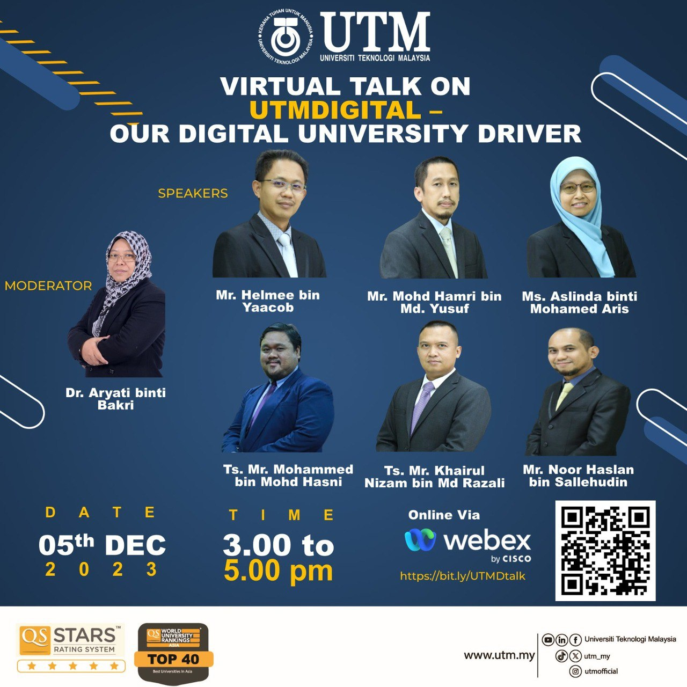

# Github UTM E-portfolio

In this E-portfolio, I will stored all the collection of my work.

Hi My name is LIOW JIA FENG.
======================================================================================================================================

A university student in Bioinfomatics
-------------------------------------

* 🌍  I'm based in Pontian,Johor
* ✉️  You can contact me at [jiafeng728372@gmail.com]
* 🧠  I'm learning in Bioinfomatics

## 🛠 Skills
C++, Python,Vs code...

## Education
I graduated in the program "UTM FOUNDATION IN PHYSICAL SCIENCE" offered by UTM SPACE

## Assignments
- [POSTER ON INDUSTRY TALK 1](https://github.com/Jiafeng7/Utm-e-portfolio/blob/main/image/Poster%20Group%207%20Assignment%201%20v.jpg)

#### Reflection 1

Through this assignment, I learned a lot of experience especially the wide range of ict jobs. They introduced many fields of work,taught a lot of skills and provided a lof of advice to let us know more about the work in the future. The most important things is that I can gain about a lot of things inprove my skills in the computer science.

- [UTM Digital (Industrial Visit video) ](https://drive.google.com/file/d/1b1AOXlodejqZw1LEypilv7YbPJhb82tX/view)

#### Reflection 2
In this assignment,our lecturer give us the opportunity to visit the UTM Digital,gaining deeper knowledge about the inner workings in UTM Digital.The area we explored was extended to the whole facility which is UTM open office,UTM Digital Care office and the UTM Data Center. This opportunity provided us with a understanding of job scopes and gain the valuable experience and skills to finish my bachelor degree in UTM. 

- [Industrial talk 2](https://github.com/Jiafeng7/Utm-e-portfolio/blob/main/pdf/GROUP%207%20REPORT%20ON%20INDUSTRY%202.pdf)

#### Reflection 3
For this assignment, UTM invited Ms.Qistina which is working in Analytics Delivery and graduated from UTM to hold this industrial talk about the system development @ credence(TM SUBSIDIARIY). During this talk, she talks about how she can easily communicate with other working personnel and she also teaches us to learn from experienced peers and when we have the abilitiy to finish the work,we will give others trust. Through this talk,our group made a report to make a summary about what we learned from it.

- [Design Thinking Project(Report)](https://github.com/Jiafeng7/Utm-e-portfolio/blob/main/pdf/SECP1513%20Report-1.pdf)

-[Design Thinking Project(Video)](https://www.youtube.com/watch?v=N6It7ssxl84)

-[Design Thinking Project(Presentation)](https://github.com/Jiafeng7/Utm-e-portfolio/blob/main/pdf/Design%20Thinking%20.pptx)

#### Reflection 4

About this assignment, our group was assigned with a project to create a prototype for design thinking project. Therefore, we using face-to-face methods to discuss what problems are facing in our society today and after the discussion we conclued that the problem that people are addicted to mobile phones is getting worse. Through the process of this project, we decided to make a application called "Escape The Phone" that can help people to overcome and prevent this problem.

Comments

1. Uniqueness or difference when compared to similar products in the current market?

- if just use existing features on phones (samsung & iphone), only got warning alerts

- existing apps in stores (app store, google play store) only has the option to limit usage of certain apps

- our app has option to also shut down the phone or turn off the screen for a limited amount of time (around 10 - 20 minutes) according to the user's preference, as a way to let the user reflect on the amount of time they have spent staring on their phones.

2. If got important matters on phone during shut down, such as messages from family or from workplace?

- setting to either disable the shut down mechanics or shorten the duration when it shuts down

- ASSEMBLE PC (LAB)

#### Reflection
In this lab, our group had hands-on experience of assembling a PC which is held at Makmal Inovasi(N28,level3A). During this class,I very enjoyed the process of assembling the PC and learned a lot of practical skills in PC assemble. By personally assembling the computer mainframe, I realized the importance of each component to the computer mainframe and learned some new knowledge about the internal parts of PC.
